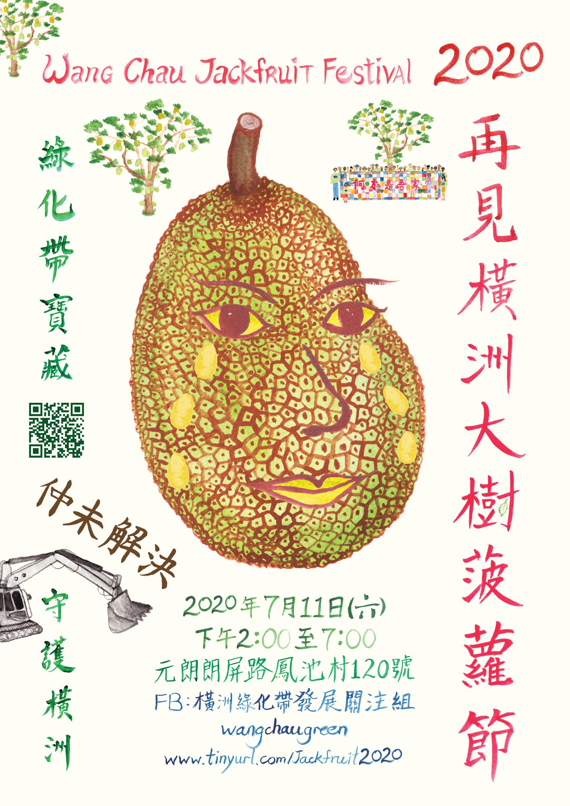

[Jackfruit Festival poster by ML] Linking to last weeks blog post: the Jackfruit Festival poster drawn by a friend of mine, who is one of the organisers, a member of the Green Belt Concern Group and the one who invited me to join the activities concerning the eviction of this Hong Kong village. The poster is not primarily about nor does it inform about student activism, yet this resistance would not have reached this stage without the involvement of many loosely related students, scholars and artists, that all played their own role in this movement. It has been a very defining moment for me as a creator without me realising it in the beginning. When I arrived in Hong Kong in August 2019, I came in contact with what I thought has been already severed from me: my roots and identity as Asian. Since then, I have been searching and working towards making sense out of what I have just retrieved. As I started a book project with a friend and collaborator earlier this year, I began to open up my  interests in every possible direction. I mentioned my thirst for knowledge to M, who invited me to join him in the activities of the village. I then often accompanied him and other friends to this village in the very north of Hong Kong, where the Shenzen lightshow replaces the sunset. Listening, documenting, photographing, hiking and eating through my days at the village, I began to absorb this atmosphere and this knowledge, that comes to you by just being there, that you just begin to understand on your own. During these days at the village, we were all just acting (and sweating _a lot_, how can they survive without AC?). There was no academic ulterior motive (do we have to academise everything?) behind anything we did. That came afterwards, when I began to reflect on the experiences made and M sharing with me his essays and papers about (Non-)indigenous wisdom, feminism ecology and socially engaged art. This began to expand my grasp about how what is happening in this village right now is linked to many bigger topics, like mentioned before a symptom of a post- and neocolonial Asia and decolonial healing in the making.  
I remember when M, K, and I sat together after dinner and discussions with villagers. We were planning together what we could do next before the eviction date, when we all suddenly realised that we are all three product designers by training. A hilarious and priceless moment. Three designers on the front porch of a soon-to-be-demolished village house somewhere in forest of northern Hong Kong amidst a global pandemic.

