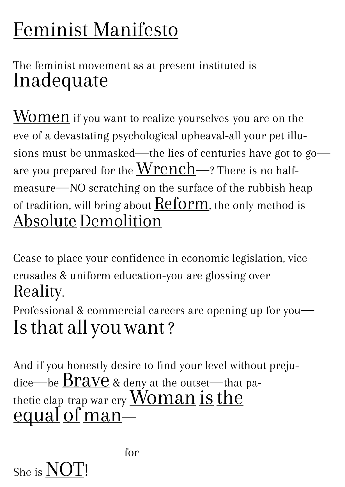

## Feminist Manifest, Mina Loy 1914

I chose the _Feminist Manifesto_ by Mina Loy because it is a brave manifesto for the time, and a necessary one. It lays the basis for many movements to come. Although addressed to women, it formulates directions that reach farther and are connected to movements concerned about rights of marginalised people.
The manifesto calls for abolition of patriarchy and all the implications that come with it. It questions concepts of masculinity and femininity, calls for independent thinking, not orienting at outside opinions and societal structures (for the lack of better descriptions). Last but not least it lays the basis for sexual demystification and liberation.

## Who am I
I don't know why I find this question particularly hard to answer. I cannot think of anything beyond the basics.
I am me. Just that. Maybe I am afraid to describe it and bring it to words? If I find it eventually I'll share it.

## What are my ambitions as a designer?
To do as I want, until I'm old, dying while doing what I want to do.
To work with others but always be independent.
To create for the community.
To give back.
To disrupt.
To have my own studio.
To work not for profit.
To find my creative soulmate.
To travel the world.
To be always busy.
To find friends, family and love.
To make others happy.
To be happy myself.
To have the resources to do all that.
To be as good to be able to teach a bit.
To always learn, always be curious, never tire, always move forward.
To be at peace.
To find my position, place and path.
To make design what I want it to be.

## A topic
What is there that has not been said before?
Since my participation in the village in Hong Kong, I am particularly interested in the topics of urban farming, linking to decolonialisation, identity, environmental justice, resistance, patriarchy, feminism ecology, repositioning farming in Asia, repositioning food production itself. I think it is a not-that-overdiscussed combination of topics that I could investigate and share some things about, especially related to this specific village / villages in Hong Kong.
And when I searched the ZHdK library for urban farming books, I found none. How can there be none? Maybe there's a secret design-y term for farming that's used and I don't know about.
